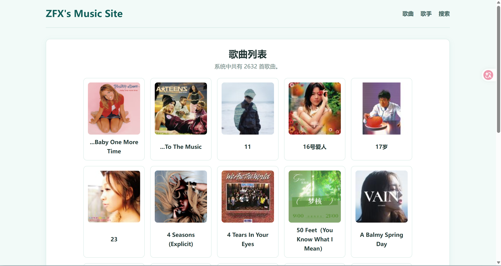
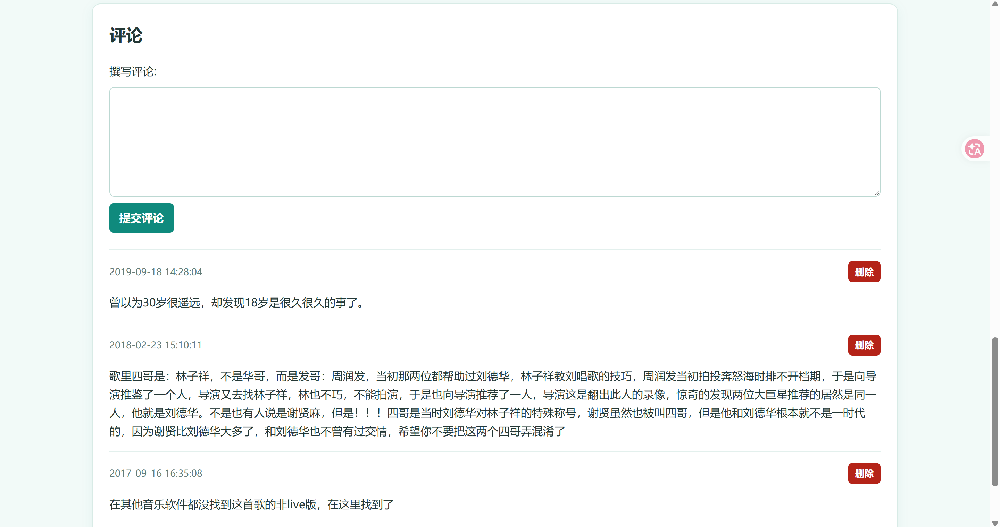
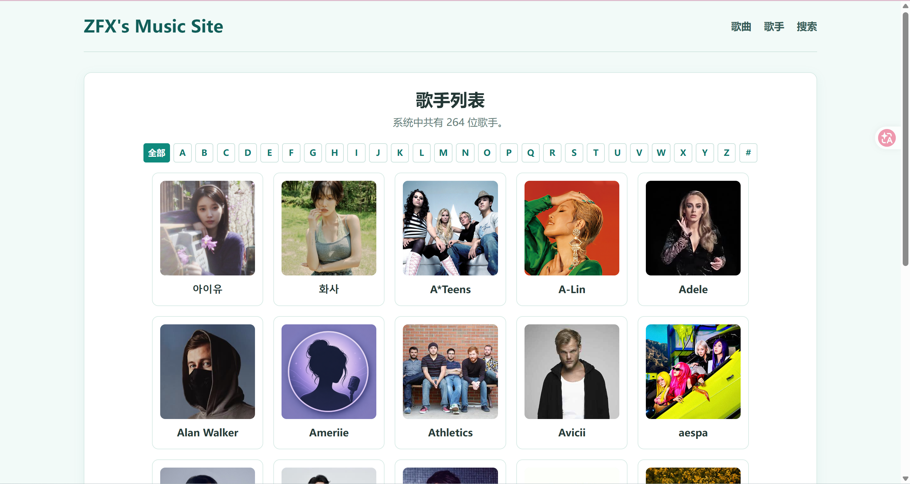
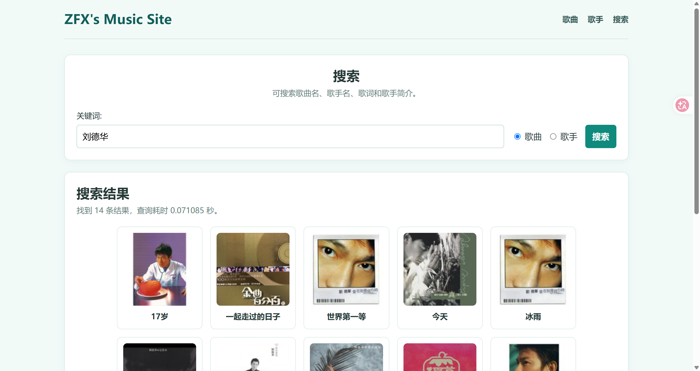
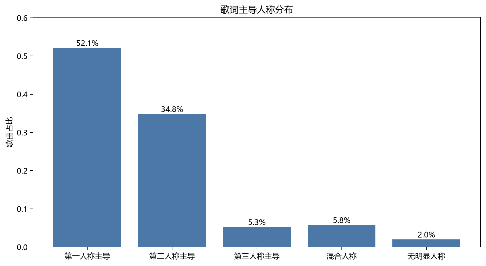
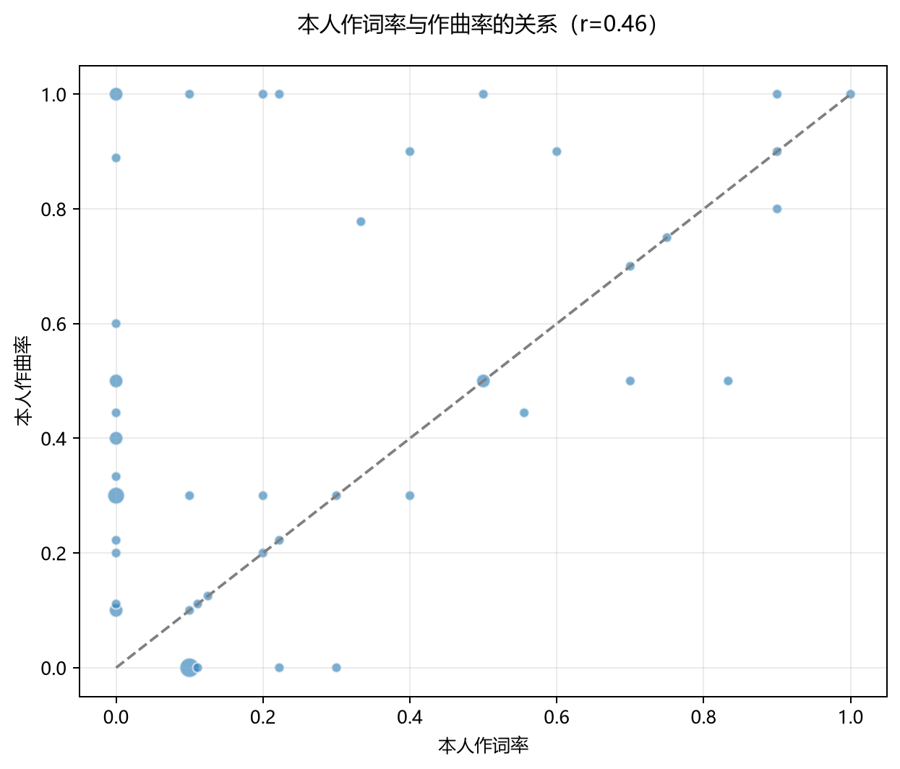
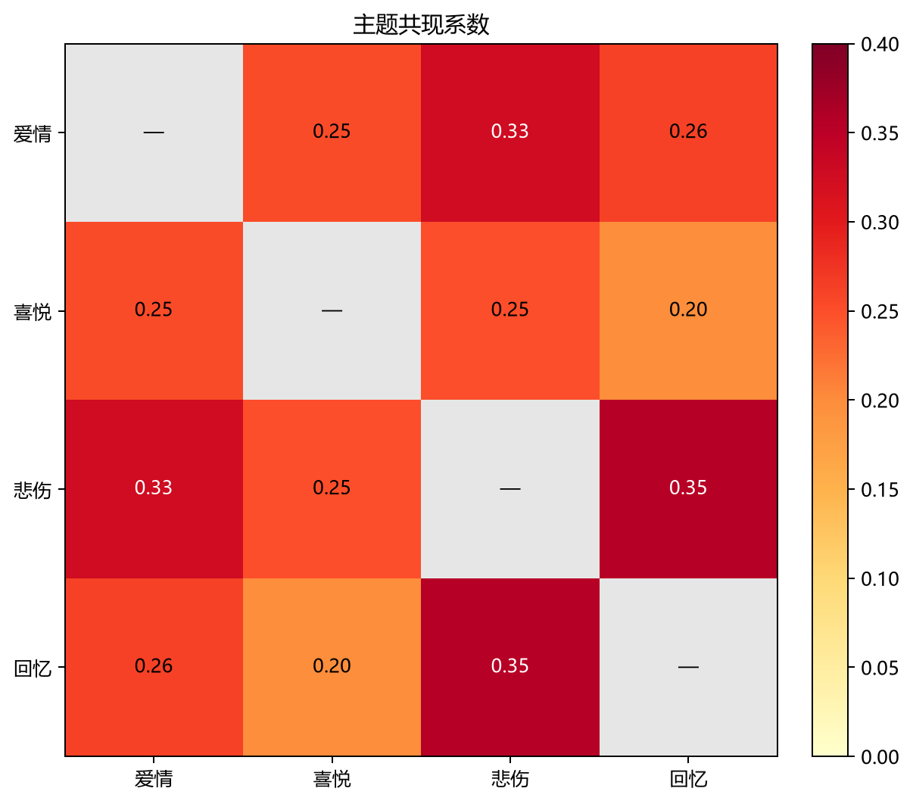

# 大作业一实验报告

> GitHub 项目地址：<https://github.com/zipolll/programming-training-project-1-MusicSite>

## 目录

1. [项目简介](#1-项目简介)
2. [项目结构](#2-项目结构)
3. [运行方法](#3-运行方法)
4. [系统功能](#4-系统功能)
5. [系统设计与数据模型](#5-系统设计与数据模型)
6. [使用的技术与方法](#6-使用的技术与方法)
7. [数据分析结果](#7-数据分析结果)
8. [局限性与改进方向](#8-局限性与改进方向)
9. [功能实现工时](#9-功能实现工时)
10. [实验感想与建议](#10-实验感想与建议)

<div style="page-break-after: always;"></div>

## 1. 项目简介

本项目是一套音乐数据采集、展示与分析系统，由爬虫系统、音乐网站系统和数据分析系统组成。

爬虫从酷我音乐采集歌手资料、歌曲、歌词和热门评论，将原始响应缓存到本地，并将结构化数据写入 SQLite。音乐网站基于 Django 提供歌曲与歌手浏览、搜索、歌词展示和评论功能。数据分析系统对中文歌词进行清洗和统计，输出分析明细、结论及可视化图表。

项目数据流程为：

```text
酷我音乐页面与接口
        ↓
原始响应缓存 data/raw/kuwo/
        ↓
数据解析与 SQLite 入库
        ↓
音乐网站展示与检索
        ↓
歌词清洗、统计与图表生成
```

<div style="page-break-after: always;"></div>

## 2. 项目结构

Git 提交中的完整目录树和文件说明见 [`README.md`](README.md) 的“项目结构与文件说明”。以下目录树展示当前本地存在、但尚未包含在 Git 提交中的运行数据和报告文件。

```text
Project1/
├── .venv/                              # [Git 忽略] Python 虚拟环境及依赖
├── __pycache__/                        # [Git 忽略] Python 字节码缓存
├── analysis/
│   ├── __pycache__/                    # [Git 忽略] 分析模块字节码缓存
│   └── output/
│       ├── *_metrics.csv               # [Git 忽略] 分析指标明细
│       ├── *_summary.csv               # [Git 忽略] 分析汇总数据
│       └── *_result.csv                # [Git 忽略] 分析结果数据
├── catalog/**/__pycache__/             # [Git 忽略] Django 应用字节码缓存
├── crawler/__pycache__/                # [Git 忽略] 爬虫模块字节码缓存
├── music_site/__pycache__/             # [Git 忽略] Django 配置字节码缓存
├── data/
│   ├── raw/kuwo/                       # [Git 忽略] 酷我音乐原始响应缓存
│   └── processed_initial/
│       └── kuwo.json                   # [Git 忽略] 早期处理阶段的合并数据快照
└── db.sqlite3                          # [Git 忽略] 本机业务数据库

```

`[Git 忽略]` 表示由 `.gitignore` 排除的本机运行产物；`[未跟踪]` 表示尚未执行 `git add` 的报告文件。

## 3. 运行方法

Python 环境创建、依赖安装、数据库迁移、网站启动、数据爬取、测试和数据分析命令均已记录在 [`README.md`](README.md) 的“启动指引”中，此处不再重复。

## 4. 系统功能

### 4.1 爬虫系统

爬虫提供三种主要能力。

#### 4.1.1 顺序爬取

系统按 A—Z 顺序读取歌手列表，逐页采集歌手资料及其歌曲。每位歌手最多保存 10 首包含有效歌词的歌曲，每首歌曲同时采集封面、歌词和最多 3 条热门评论。默认目标为不少于 100 位歌手和 2000 首歌曲。

#### 4.1.2 指定 URL 爬取

运行爬虫后可输入酷我歌手主页 URL。程序从查询参数或路径中提取歌手 ID，只采集该歌手的资料与歌曲，适合补充指定歌手或调试单个采集任务。

#### 4.1.3 断点续爬

所有网络响应按类型写入 `data/raw/kuwo/`。再次运行时优先读取缓存，并根据数据库中的来源 URL 恢复已保存的歌手和歌曲 ID，自动跳过重复数据。中断后可直接继续执行，无需重新请求已经完成的内容。

### 4.2 音乐网站系统

#### 4.2.1 歌曲浏览

首页以卡片形式分页展示歌曲，每页 20 首，支持首页、末页、前后翻页和指定页码跳转。当前共有 **2632 首歌曲**，合计 132 页。



#### 4.2.2 歌曲详情与评论

歌曲详情页展示封面、歌名、歌手、来源链接和完整歌词。页面下方按时间倒序展示评论，并支持新增和删除评论。



#### 4.2.3 歌手浏览

歌手列表每页展示 20 位歌手，当前共有 **264 位歌手**，合计 14 页。列表支持 A—Z 及 `#` 首字母筛选；歌手详情页展示头像、简介、来源链接和已收录歌曲。



#### 4.2.4 综合搜索

搜索分为歌曲和歌手两种模式。歌曲搜索覆盖歌名、歌手名和歌词；歌手搜索覆盖姓名和简介。结果按匹配程度排序并分页展示，同时显示结果数量和后端查询耗时。

下图以“刘德华”为关键词搜索歌曲，共得到 14 条结果，本次查询耗时约 0.07 秒。



### 4.3 数据分析系统

#### 4.3.1 数据清洗

分析程序通过 Django ORM 读取歌曲，删除空行和作词、作曲、编曲、制作、录音等元数据行，并排除纯音乐、歌词不足 10 行及汉字比例不超过 60% 的歌曲。2632 首歌曲中共有 **1504 首**进入后续分析。

#### 4.3.2 数据统计分析

系统完成三项统计：

- 统计第一、第二、第三人称代词，判断每首歌词的主导人称；
- 识别作词、作曲署名，计算歌手本人作词率和作曲率；
- 检测爱情、喜悦、悲伤、回忆四类主题，并用 Jaccard 系数计算主题共现度。

每项分析均生成 CSV 明细和汇总结果，便于检查单首歌曲和总体统计。

#### 4.3.3 图表绘制

系统使用 Matplotlib 绘制主导人称柱状图、歌手创作参与率气泡散点图和主题共现热力图，输出到 `analysis/output/`，供分析报告直接引用。

## 5. 系统设计与数据模型

### 5.1 系统设计

项目采用分层结构：

| 层次 | 组成 | 职责 |
| --- | --- | --- |
| 数据采集层 | `crawler/` | 请求、缓存、解析、断点判断和入库 |
| 数据存储层 | SQLite、原始缓存 | 保存结构化业务数据和原始响应 |
| 网站服务层 | `catalog/`、`music_site/` | 路由、ORM 查询、表单和页面渲染 |
| 数据分析层 | `analysis/` | 清洗、统计、CSV 输出和图表绘制 |
| 展示层 | `templates/`、`static/` | 页面结构、导航、卡片、表单和样式 |

SQLite 是三个系统共用的结构化数据接口；原始缓存保存数据来源，支持断点续爬和重复解析。

### 5.2 数据模型

| 模型 | 主要字段 | 关系与约束 |
| --- | --- | --- |
| `Artist` | 姓名、首字母、简介、图片、来源链接 | 来源链接唯一；姓名建立索引 |
| `Song` | 歌名、歌手、歌词、封面、来源链接 | 关联 `Artist`；来源链接唯一；歌名建立索引 |
| `Comment` | 歌曲、正文、创建时间 | 关联 `Song`；按创建时间倒序排列 |

当前数据库统计如下：

| 数据项 | 数量 | 完整性说明 |
| --- | ---: | --- |
| 歌手 | 264 位 | 263 位具有远程头像 |
| 歌曲 | 2632 首 | 全部具有歌词，2631 首具有远程封面 |
| 评论 | 5391 条 | 包括热门评论及本地评论 |
| 有效中文歌曲 | 1504 首 | 实际进入数据分析 |

### 5.3 数据存储

#### 5.3.1 SQLite 业务数据库

`db.sqlite3` 保存网站使用的歌手、歌曲和评论，当前大小为 **9,199,616 字节（约 8.77 MiB）**。网站和分析程序均通过 Django ORM 访问该数据库。

#### 5.3.2 酷我原始响应缓存

`data/raw/kuwo/` 共保存 **7124 个文件**，总计 **82,379,001 字节（约 78.56 MiB）**。

| 缓存类别 | 文件数 | 大小（字节） | 内容 |
| --- | ---: | ---: | --- |
| `artist_lists` | 26 | 159,206 | A—Z 歌手列表接口响应 |
| `artists` | 297 | 45,551,479 | 歌手资料 HTML |
| `comments` | 3127 | 8,191,078 | 歌曲热门评论 JSON |
| `song_lists` | 388 | 7,993,393 | 歌手歌曲列表 JSON |
| `songs` | 3286 | 20,483,845 | 歌词 JSON |
| **合计** | **7124** | **82,379,001** | 原始响应缓存总量 |

#### 5.3.3 `kuwo.json` 合并数据快照

`data/processed_initial/kuwo.json` 是项目早期将处理结果集中保存为单一 JSON 文件时生成的数据快照，大小为 **8,194,262 字节（约 7.81 MiB）**。文件包含 260 位歌手和 2592 首歌曲。系统改为“原始响应分文件缓存 + SQLite 业务数据库”后，该文件仅作为历史数据备份保留。

## 6. 使用的技术与方法

### 6.1 爬虫系统

| 技术或方法 | 用途 |
| --- | --- |
| Requests | 访问酷我音乐页面和 JSON 接口 |
| Beautiful Soup | 解析歌手资料 HTML |
| 正则表达式 | 提取图片字段和歌手 ID |
| fake-useragent | 生成桌面端 User-Agent |
| pypinyin | 生成中文歌手的首字母分类 |
| 文件缓存 | 优先读取已保存的原始响应 |
| 集合去重 | 快速判断已保存的外部 ID |
| 数据库事务 | 保证单个歌手相关数据完整写入 |
| 幂等写入 | 避免重复歌手、歌曲和评论 |

### 6.2 音乐网站系统

| 技术或方法 | 用途 |
| --- | --- |
| Django 5.2 | 路由、视图、ORM、表单、模板和管理命令 |
| SQLite | 保存结构化业务数据 |
| Django Template、HTML、CSS | 构建列表、详情、搜索和分页页面 |
| `Paginator` | 分页展示歌曲、歌手和搜索结果 |
| `Q` 对象 | 组合多字段搜索条件 |
| `Case`、`When` | 按匹配程度排列搜索结果 |
| `select_related`、`prefetch_related` | 减少关联对象查询次数 |
| `ModelForm` | 校验和保存评论 |

### 6.3 数据分析系统

| 技术或方法 | 用途 |
| --- | --- |
| pandas | 数据清洗、分组统计、相关计算和 CSV 输出 |
| Matplotlib | 绘制柱状图、气泡散点图和热力图 |
| 正则表达式 | 分离制作信息与真实歌词 |
| 规则筛选 | 排除纯音乐、短歌词和非中文歌词 |
| 人称词频 | 判断歌词主导人称 |
| 署名规范化 | 识别本人作词和作曲情况 |
| Pearson 相关系数 | 衡量作词率与作曲率的相关程度 |
| 主题关键词与 Jaccard 系数 | 识别主题并计算共现程度 |

## 7. 数据分析结果

### 7.1 歌词主导人称



1504 首有效中文歌曲中，第一人称主导 784 首，占 52.1%；第二人称主导 524 首，占 34.8%。两者合计占 **86.9%**，说明样本歌词以自我表达和面向他人诉说为主。

### 7.2 歌手本人作词率与作曲率



在满足样本条件的 52 位歌手中，28 位歌手的本人作曲率更高，12 位歌手的本人作词率更高，另有 12 位两项相等。作词率与作曲率的 Pearson 相关系数为 **0.463**，呈中等程度正相关。

### 7.3 歌词主题共现



悲伤与回忆的 Jaccard 系数为 **0.354**，是四类主题中共现程度最高的组合；爱情与悲伤次之，系数为 0.326。样本中的回忆表达较常与悲伤情绪同时出现。

详细分析方法、统计表和代码见：

- [`analysis/result.md`](analysis/result.md)：完整分析报告；
- [`analysis/data_utils.py`](analysis/data_utils.py)：数据读取、歌词清洗和公共筛选；
- [`analysis/person_perspective.py`](analysis/person_perspective.py)：主导人称分析；
- [`analysis/artist_creation.py`](analysis/artist_creation.py)：本人作词率与作曲率分析；
- [`analysis/theme_cooccurrence.py`](analysis/theme_cooccurrence.py)：主题识别与共现分析；
- [`analysis/output/`](analysis/output/)：CSV 结果和图表。

## 8. 局限性与改进方向

1. 数据为课程实验期间采集的样本，每位歌手最多保存约 10 首歌曲，分析结论不代表完整曲库。
2. 关键词和正则方法无法完整识别隐喻、否定、同义词和上下文，可进一步引入分词、词性标注或语义模型。
3. 词曲署名采用规范化后的完整匹配，暂未处理别名、组合成员和多人联合署名。
4. 评论功能未设置用户身份和权限；多人使用时需要增加登录、评论所有权和内容审核。

## 9. 功能实现工时

| 功能模块 | 实际耗时（小时） |
| --- | ---: |
| 需求分析与项目设计 | **4** |
| 酷我音乐爬虫与缓存 | **6** |
| Django 数据模型与数据库 | **6** |
| 歌曲、歌手列表及详情页 | **6** |
| 搜索、排序与分页 | **2** |
| 评论功能 | **2** |
| 歌词清洗与三项数据分析 | **4** |
| 页面样式与交互优化 | **4** |
| 测试、调试和文档 | **3** |
| **合计** | **37** |

## 10. 实验感想与建议

### 10.1 实验感想

1. 先思考后动手：刚开始完成这个项目时，我觉得任务量很大，爬虫、Django 网站和数据分析涉及的内容也比较分散。为此，我尝试先规划整体框架，明确各模块的功能、数据流和接口，再逐步填写具体实现，而不是先分别写代码、最后再拼接。这种方法使项目后续的逻辑和结构更加清晰，也让我认识到，面对规模较大的任务，先完成总体设计往往比立即动手更有效率。

2. 利用 AI 高效学习新知识：项目实现过程中，我查阅了 Django 文档、HTML 指南和 CSS 教程等大量资料。我逐渐发现，学习新技术时，可以先把权威文档交给 AI，要求它按照当前任务带我阅读、解释关键概念，再回到原文核对细节。这种方式降低了阅读陌生文档的门槛，也明显提高了本次大作业中学习和应用新知识的效率。

3. 编码规范提升开发效率：这次实验也改变了我对编码规范和多文件编程的看法。此前我不习惯将程序拆分到多个文件，也不习惯为 Python 函数完整标注参数与返回值，最初觉得这些要求增加了负担。但随着功能增加，清晰的模块划分、统一的命名和类型标注使测试、调试、分析和修改都更加方便。编码规范并不只是形式要求，它能够直接提高中大型项目的开发效率和可维护性。

### 10.2 课程建议

大作业文档目前将 Django 部分安排在爬虫之后，这可能是出于学习难度逐步递进的考虑。但结合本次实践，我认为可以考虑先介绍 Django 和数据库，再开展爬虫部分。

一方面，提前学习 Django 数据模型和 ORM 后，学生可以自然地使用数据库保存爬虫结果，并在此基础上实现去重和断点续爬。我最初使用单个 JSON 文件保存数据，也是在学习 Django 后才重新调整爬虫，将结构化数据直接写入数据库。

另一方面，先设计网站需要展示的内容，再确定爬虫需要采集的字段，更符合实际项目的开发顺序。本次实践中，我曾希望网站展示更多信息，也希望在分析部分得到更丰富的结论，但由于前期没有采集相应字段，只能放弃部分设想。如果先完成网站需求和数据模型设计，再按需求采集数据，能够减少后期返工，也能使最终功能更加完整。
